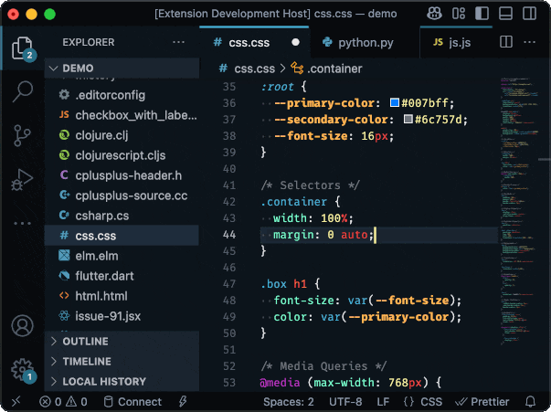

# Glacier Black & White

*Glacier Black & White* is a sleek, colorful theme duo for Visual Studio Code, inspired by the
Sublime Text theme [Glacier](https://github.com/shovelandsandbox/glacier-theme) by [Joey
Figaro](https://github.com/joeyfigaro). Featuring the bold *Glacier Black* and its daytime alter-ego
*Glacier White*, this theme provides a cohesive, vibrant experience day or night.



## About

*Glacier Black & White* stems from my long-time love for the Glacier color scheme. [Daniel
Imms](https://marketplace.visualstudio.com/items?itemName=Tyriar.theme-glacier) and
[Kal](https://marketplace.visualstudio.com/items?itemName=Kal.theme-glacier) ported Glacier to VS
Code, but their versions left the UI unstyled, so I created *Glacier Black* to fully theme the
interface using Glacier's newer palette. Now, *Glacier White* joins it, flipping the same palette
into a light scheme with a tweak to the yellows for visibility.

## Installation

To install *Glacier Black & White* in Visual Studio Code:

1. Click the Extensions button in the sidebar.
2. Search for `Glacier Black & White`.
3. Click **Install**.
4. Open the Command Palette (Ctrl/Cmd+Shift+P), search for `Color Theme`, and pick *Glacier Black* or *Glacier White*.

## Recommended Settings

Enhance your experience with these VS Code settings. Open the Command Palette (Ctrl/Cmd+Shift+P), select `Open User Settings (JSON)`, and paste the following. These tweaks optimize the themes and reflect my personal VS Code preferences. Note: the ligature codes are specific to Fira Code.

```json
{
  "editor.fontFamily": "FiraCode Nerd Font, Fira Code",
  "editor.fontLigatures": "'cv02', 'ss01', 'zero', 'ss03', 'cv18', 'cv29', 'cv30', 'ss09', 'cv06', 'ss04'",
  "editor.renderControlCharacters": true,
  "editor.renderFinalNewline": "dimmed",
  "editor.renderWhitespace": "boundary",
  "editor.rulers": [100],
  "editor.stickyScroll.enabled": true,
  "editor.wordWrap": "off",
  "files.insertFinalNewline": true,
  "files.trimFinalNewlines": true,
  "files.trimTrailingWhitespace": true,
  "terminal.integrated.cursorBlinking": true,
  "terminal.integrated.cursorStyle": "line",
  "terminal.integrated.cursorWidth": 2,
  "terminal.integrated.fontFamily": "FiraCode Nerd Font, Fira Code",
  "terminal.integrated.fontLigatures.enabled": true,
  "terminal.integrated.fontLigatures.featureSettings": "'cv02', 'ss01', 'zero', 'ss03', 'cv18', 'cv29', 'cv30', 'ss09', 'cv06', 'ss04'",
  "window.autoDetectColorScheme": true,
  "workbench.colorTheme": "Glacier Black",
  "workbench.preferredDarkColorTheme": "Glacier Black",
  "workbench.preferredLightColorTheme": "Glacier White"
}
```

### Font Recommendation

Pair *Glacier Black & White* with the [Nerd Font](https://github.com/ryanoasis/nerd-fonts) version of [Fira Code](https://github.com/tonsky/FiraCode) for the best look. Nerd Fonts add glyphs such as powerline symbols and icons to existing fonts.

## Color Palette


This palette powers both *Glacier Black* and *Glacier White*. *Glacier White* flips the lighter and
darker colors in most places. In some cases, the lighter yellow color (`#F7EF9C`) did not have enough
contrast with the lighter backgrounds in *Glacier White*, so I introduced a richer golden color
(`#C4A010`) there.

## Thanks!

Thanks for checking out *Glacier Black & White*! Tweak the settings to your taste and enjoy coding in style. Please [let me know](https://github.com/bcrotty/glacier-black-vscode/issues) if you have any feedback!

## Acknowledgements

Big thanks to:
- [Joey Figaro](https://github.com/joeyfigaro) for the original Glacier theme.
- [Daniel Imms](https://marketplace.visualstudio.com/items?itemName=Tyriar.theme-glacier) and [Kal](https://marketplace.visualstudio.com/items?itemName=Kal.theme-glacier) for their ports.
- [Sarah Drasner](https://github.com/sdras) for her [Night Owl](https://github.com/sdras/night-owl-vscode-theme) theme, which guided my approach.
