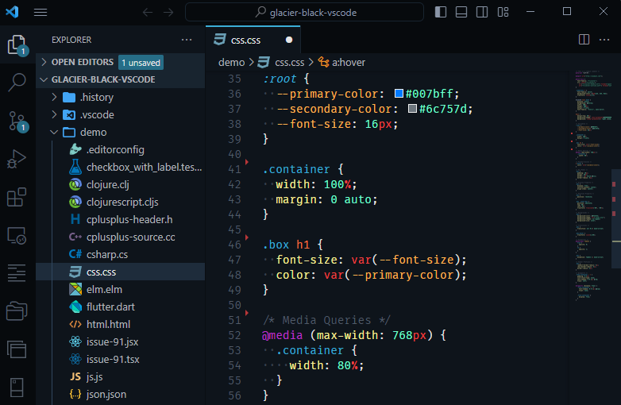
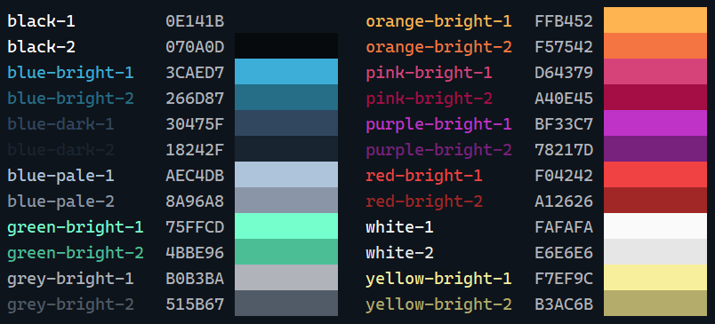

# Glacier Black

Glacier Black is a sleek and colorful theme for Visual Studio Code inspired by the Sublime Text theme [Glacier](https://github.com/shovelandsandbox/glacier-theme) by [Joey Figaro](https://github.com/joeyfigaro).



## About



Glacier has been a personal favorite color scheme for a long time. I'm grateful to [Daniel Imms](https://marketplace.visualstudio.com/items?itemName=Tyriar.theme-glacier) and [Kal](https://marketplace.visualstudio.com/items?itemName=Kal.theme-glacier) for porting it from Sublime Text. However, their versions do not skin the whole interface, which led to me creating my own. Glacier Black also uses Glacier's newer color palette.

## Installation

To install the Glacier Black theme in Visual Studio Code, follow these steps:

1.  Click the Extensions button in Visual Studio Code.
2.  Search for `Glacier Black`.
3.  Click **Install**.
4.  If the theme picker doesn't come up, open the Command Palette (Ctrl/Cmd+Shift+P) and search for `Color Theme`.
5.  Click Glacier Black on the popup menu.

## Recommendedations

### Visual Studio Code Settings

To enhance your experience with the Glacier Black theme, you can apply these personal settings. Open the Command Palette (Ctrl/Cmd+Shift+P) and search for `Open User Settings (JSON)`. Then, paste the following settings into the JSON file:

```
"editor.fontFamily": "FiraCode Nerd Font, Fira Code, Consolas",
"editor.fontLigatures": "'cv02', 'ss01', 'zero', 'ss03', 'cv18', 'cv29', 'cv30', 'ss09'"
"editor.renderControlCharacters": true,
"editor.renderFinalNewline": "dimmed",
"editor.renderWhitespace": "boundary",
"editor.rulers": [100],
"editor.stickyScroll.enabled": true,
"editor.wordWrap": "off",
"files.insertFinalNewline": true,
"files.trimFinalNewlines": true,
"files.trimTrailingWhitespace": true,
"terminal.integrated.cursorBlinking": true,
"terminal.integrated.cursorStyle": "line",
"terminal.integrated.cursorWidth": 2,
"terminal.integrated.fontFamily": "FiraCode Nerd Font, Fira Code, Consolas",
"window.autoDetectColorScheme": true,
"workbench.colorTheme": "Glacier Black",
"workbench.preferredDarkColorTheme": "Glacier Black",
"workbench.preferredLightColorTheme": "Monokai Light",
```

### Recommended Font
For the best experience with Glacier Black, I recommend using the [Nerd Font](https://github.com/ryanoasis/nerd-fonts) version of [Fira Code](https://github.com/tonsky/FiraCode). Nerd Fonts include a variety of extra glyphs that can be useful for developers.

### Light Theme
For daytime use, I recommend the [Monokai Light](https://marketplace.visualstudio.com/items?itemName=anoff.theme-monokai-light) theme.

## Thanks!
Thanks for checking out Glacier Black! Feel free to customize these settings to suit your preferences. Enjoy coding!

## Acknowledgements
Beyond those mentioned above, I'd like to thank [Sarah Drasner](https://github.com/sdras) for her excellent [Night Owl](https://github.com/sdras/night-owl-vscode-theme) theme and code samples, which were a tremendous help in creating Glacier Black.
